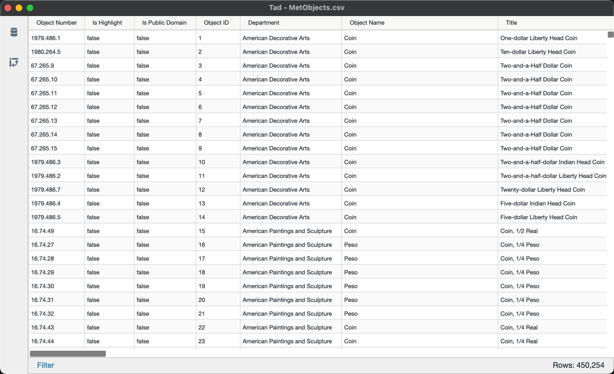
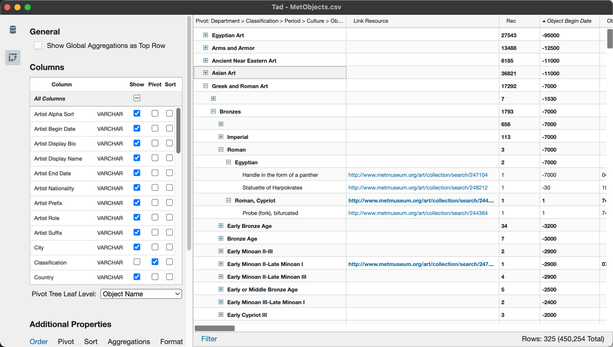

# Tad

This repository contains the source code for [Tad](https://www.tadviewer.com), an application for viewing and analyzing tabular
data sets.

The Tad desktop application enables you to quickly view and explore tabular data in several of the most popular
tabular data file formats: CSV, Parquet, and SQLite and DuckDb database files.
Internally, the application is powered by an in-memory instance of [DuckDb](https://duckdb.org/), a fast, embeddable database engine optimized for analytic queries.

The core of Tad is a React UI component that implements a hierarchical pivot table that allows you to specify a combination of pivot, filter, aggregate, sort, column selection, column ordering and basic column formatting operations. Tad delegates to a SQL database for storage and analytics, and generates SQL queries to perform all
analytic operations specified in the UI.

Tad can be launched from the command line like this:

    $ tad MetObjects.csv

This will open a window with a scrollable view of the full contents of the CSV file:

Tad uses [SlickGrid](http://slickgrid.net/) for rendering the data grid. This allows Tad to support efficient linear
scrolling of the entire file, even for very large (millions of rows) data sets.

A few additional mouse clicks on the above view yields this view, pivoted by a few
columns (`Department`, `Classification`, `Period` and `Culture`), sorted by the `Object Start Date` column, and
with columns re-ordered:

# Installing Tad

The easiest way to install the Tad desktop app is to use a pre-packaged binary release. See [The Tad Landing Page](http://tadviewer.com/#news) for information on the latest release and download links, or go straight to the [releases](./releases) page.

# History and What's Here

Tad was initially released in 2017 as a standalone desktop application for viewing and exploring CSV files.

The core of Tad is a React UI component that implements a hierarchical pivot table that allows you to specify a combination of pivot, filter, aggregate, sort, column selection, column ordering and basic column formatting operations. Tad delegates to a SQL database for storage and analytics, and generates SQL queries to perform all
analytic operations specified in the UI.

This repository is a modular refactor of the original Tad source code, with several key improvements on the original code base:

- The repository is organized as a modular [Lerna](https://lerna.js.org/) based monorepo.
- The code has been ported to TypeScript and the UI code has been updated to React Hooks.
- There is support for communicating with multiple database back ends for reltab (Tad's SQL generation and query evaluation layer), in addition to the original sqlite. Current backends (in varying degrees of completeness) include DuckDb, Snowflake, Google BigQuery, and AWS Athena (Presto)
- There is a minimal proof-of-concept web-based front-end to demonstrate how Tad can be deployed on the web.
- The core Tad pivot table component now builds in its own module independent of any front end. This should allow embedding the Tad pivot table in other applications or contexts.

## The Essential Packages

The core packages that are used to build Tad are found in the [packages](./packages) sub-directory. These are the packages
used to build the Tad desktop application:

- [**reltab**](./packages/reltab) - The core abstraction used in Tad for programmatically constructing and executing relational SQL queries. This also defines the driver interface implemented by specific database back-ends, and a small, transport-agnostic remoting layer to allow queries and results to be transmitted between a web browser
  (or electron renderer process) and a reltab backend server.
- [**reltab-duckdb**](./packages/reltab-duckdb/) -- reltab driver for DuckDb
- [**reltab-sqlite**](./packages/reltab-sqlite/) -- reltab driver for SQLite
- [**aggtree**](./packages/aggtree/) - A library built on top of reltab for constructing pivot trees from relational queries.
- [**tadviewer**](./packages/tadviewer/) - The core Tad pivot table UI as a standalone, embeddable React component.
- [**tad-app**](./packages/tad-app/) - The Tad desktop application, built with Electron

## Experimental Packages

This repository also includes a number of proof-of-concept experimental packages, in varying states of completeness. These are provided for reference and as a starting
point for further investigation and development.

- [**tadweb-app**](./packages/tadweb-app/) - A minimal web app built with [tadviewer](./packages/tadviewer/), to demonstrate Tad running in a web browser.
- [**tadweb-server**](./packages/tadweb-server/) - A reference web server for serving the Tad web app and providing the reltab back end.
- [**reltab-aws-athena**](./packages/reltab-aws-athena/) - reltab driver for AWS Athena
- [**reltab-bigquery**](./packages/reltab-bigquery/) - reltab driver for Google BigQuery
- [**reltab-snowflake**](./packages/reltab-snowflake/) - reltab driver for Snowflake

# Building Tad from Source

Detailed instructions on building tad from sources available in [doc/building.md](doc/building.md)
