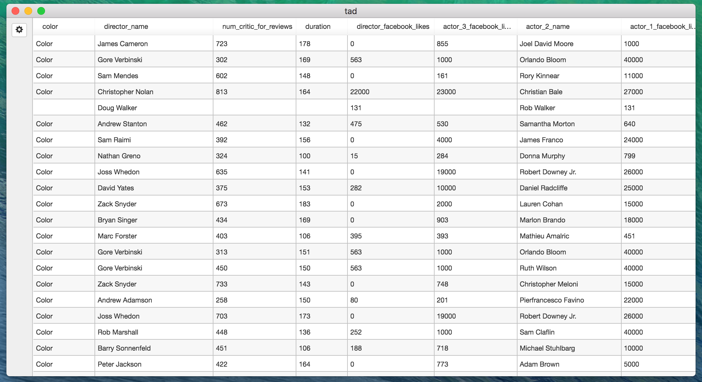

# Tad

Tad is a desktop application for viewing and analyzing tabular data (such as CSV files).

Launching tad from the command line like this:

    $ tad movie_metadata.csv

will open a new window with an interactive grid view of the file contents:

Tad's main grid component is actually a full featured
[pivot table](https://en.wikipedia.org/wiki/Pivot_table); a few additional mouse clicks from the above view yields this:

# Building Tad from Source

## Pre-requisites:  Npm and yarn

To build Tad, you should have [node](https://nodejs.org/en/), `npm` and [yarn](https://yarnpkg.com/) installed locally.  The versions used for development are:

    $ node --version
    v7.1.0
    $ npm --version
    3.10.9
    $ yarn --version
    0.17.10

## Clone the repository

    $ git clone git@github.com:antonycourtney/tad.git
    $ cd tad

## Install JavaScript package Dependencies

    $ yarn install

This will install dependencies from `package.json` from NPM. This will take some time, particularly if this is the first time you are downloading many of the dependencies.

## Build static assets

This step will install various static assets (such as the Bootstrap CSS file) into a common build directory used by the application:

    $ yarn run build

## Run webpack

Open a new terminal window in the same directory, and run

    $ yarn start webpack:watch

This will use [webpack](https://webpack.github.io/) and [Babel](https://babeljs.io/) to compile and bundle the ES2015 sources into older versions of JavaScript supported by node.js and Chromium.

## Rebuild binary libraries with electron-rebuild

Tad depends on the sqlite npm package, which in turn depends on the SQLite library, implemented in C++.  For reasons I don't fully understand related to how libraries are
loaded by node.js and Electron, it's necessary to recompile this code from source
*every time a new package is installed in our application*.

Immediately after performing a `yarn install` step, run:

    $ yarn run electron-rebuild

This will take considerable time (around 70 seconds on my Late 2013 MacBook Pro).

**Note**:  Every time a new dependency is added to the application (using `yarn add`), it is necessary to re-run `yarn install` and electron-rebuild, as follows:

    $ yarn install
    $ yarn run electron-rebuild

## Run Tad

Finally, to run the development version of Tad, try:

    $ yarn start csv/bart-comp-all.csv

This should start the application using the specified CSV file.

# Packaging a Release

I've explored both [electron-packager](https://github.com/electron-userland/electron-packager) and [electron-builder](https://github.com/electron-userland/electron-builder) for packaging.
For the moment I'm using `electron-builder`, but I'm not currently using the generated install wizard (DMG).

Note that, due to an alleged bug in Yarn's handling of sub-processes, *one must use npm (not Yarn!) to run this build step*:

    $ npm run build

This should create a full application in `./dist/mac`.  I've been manually combining that with `tools/scripts/install.sh`
in `./release` and tar'ing up the result to form a release; these latter steps should be automated.

# Implementation / Architecture

Tad is an [Electron](http://electron.atom.io/) application written in ES2015 using [flow](https://flowtype.org/) type annotations.
Tad's front end User Interface is implemented in [React](https://facebook.github.io/react/), using [SlickGrid](https://github.com/mleibman/SlickGrid) for the main grid component.
In the main process, Tad uses [SQLite](https://sqlite.org/) for internal storage and efficient queries on tabular data.  (TODO: architecture diagram)
