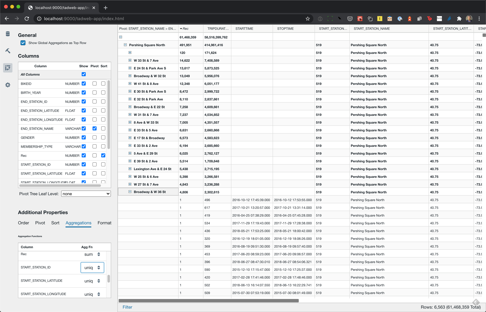

# Tad

This repository contains the source code for [Tad](https://www.tadviewer.com), an open source (MIT Licensed) pivot table for SQL data sources, packaged both as a web application and a standalone desktop app.



Tad was initially released in 2017 as a standalone desktop application for viewing and exploring CSV files.
This repository is a modular refactor of the original Tad source code, with several key improvements on the original code base:

- The repository is organized as a modular [Lerna](https://lerna.js.org/) based monorepo, with (currently) 10 distinct npm modules (found in **packages/**).
- The code has been ported to TypeScript and the UI code has been updated to React Hooks.
- There is support for communicating with multiple database back ends for reltab (Tad's SQL generation and query evaluation layer), in addition to the original sqlite.  Current backends (in varying degrees of completeness) include Snowflake, Google BigQuery, AWS Athena (Presto)
- Tad now has a simple web-based front-end (in addition to the Electron desktop application)
- The core Tad pivot table component now builds in its own module independent of any front end. This 
should allow embedding the Tad pivot table in other applications or contexts, such as Jupyter notebooks.

## Quick Start

### Pre-requisites:  Node, Npm and Lerna

To build Tad, you should have [node](https://nodejs.org/en/) and `npm`(https://www.npmjs.com/get-npm) (included when you install Node.js) installed.  The versions of these tools used for development are:

    $ node --version
    v12.13.1
    $ npm --version
    6.12.1  

Once you have Node installed, you should also install [lerna](https://lerna.js.org/) globally using npm:

    $ npm install --global lerna

### Installing dependencies and linking modules (Bootstrapping)

Lerna supports a process called [bootstrapping](https://github.com/lerna/lerna/tree/main/commands/bootstrap#readme) that links local packages together and installs any remaining dependencies. To the extent possible, lerna tries to hoist common dependencies needed by different packages in the monorepo.
To bootstrap Tad correctly, run the following:

    $ npm run bootstrap

This runs the standard lerna `bootstrap` command with a few extra arguments needed for how Tad's source is structured.

### Building Everything

After bootstrapping, run the following script to try and build everything up to the reference web server:

    $ ./build-web.sh

### Snowflake Credentials

Set the environment variables `$RELTAB_SNOWFLAKE_ACCOUNT`, `$RELTAB_SNOWFLAKE_USERNAME` and `$RELTAB_SNOWFLAKE_PASSWORD` with a valid account name, username and password, respectively, for a Snowflake deployment.

### BigQuery Credentials

If you have a Google BigQuery account, set the environment variable `$GOOGLE_APPLICATION_CREDENTIALS` to the path of a bigquery account credentials JSON file.
If you do not have a Google BigQuery account, make a local edit `packages/tadweb-server/src/server.ts` and
comment out the call `await initBigquery();` at around line 145.

### Running the web server

    $ cd packages/tadweb-server
    $ npm start

If all goes well, you will see something like:

```
db initialization complete
Listening on port  9000
```

open a web browser to `localhost:9000` and all should be good.

## What's Here

A brief summary of the packages (modules) in this repository, found in the `packages` directory:


- **reltab** - The core abstraction used in Tad for programatically constructing and executing relational SQL queries.  This also defines the driver interface for various specific database back-ends, and a small, transport-agnostic remoting layer to allow queries and results to be transmitted between the browser and a middle-tier.
    - **reltab-sqlite** -- SQLite driver for reltab
    - **reltab-aws-athena** - AWS Athena driver for reltab 
    - **reltab-bigquery** - Google BigQuery driver for reltab
    - **reltab-snowflake** - Snowflake driver for reltab
- **aggtree** - A library built on top of reltab for creating pivot trees from relational queries.
- **tadviewer** - The core pivot table UI as a standalone, embeddable React component.
- **tad-app** - Standalone desktop app for Tad, built with Electron
- **tadweb-app** - A minimal web app built with tadviewer
- **tadweb-server** - A reference web server for serving the Tad web app and providing the reltab middle tier.

## Iterating during UI Development

When iterating on the UI during development, after building everything I recommend keeping three windows open:

- In `packages\tadviewer`, running `npm run watch`
- In `packages\tadweb-app`, running `npm run watch`
- In `tadweb-server`, running `npm start`

With those running continuously, you should be able to just hit reload in your browser on `localhost:9000` to pick up any code changes.  Note that changes in below `tadviewer` (in `reltab` for example) will require you to explicitly compile in that directory (with `npm run build`). 